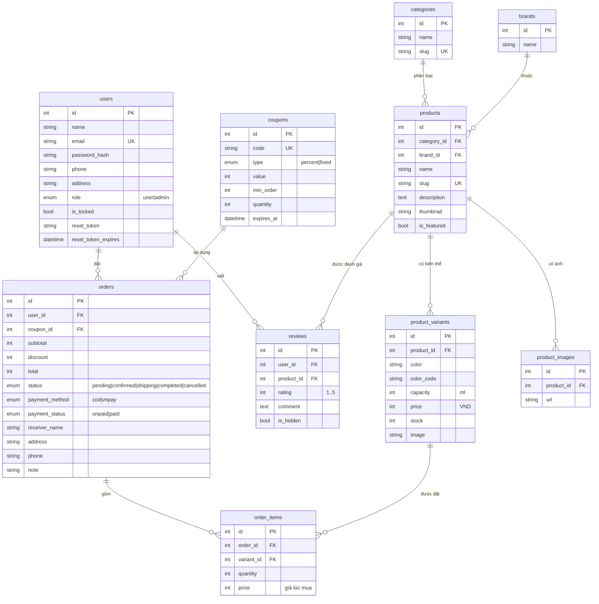

# Sơ đồ quan hệ dữ liệu (ERD) — AQUA Shop

Sơ đồ dưới đây vẽ bằng Mermaid. Xem trực tiếp trên GitHub/VS Code (có cài extension Mermaid),
hoặc dán vào https://mermaid.live để xuất ảnh đưa vào báo cáo.

## Mô tả quan hệ

| Quan hệ | Loại | Ý nghĩa |
|---|---|---|
| users → orders | 1–n | Một khách có nhiều đơn hàng |
| users → reviews | 1–n | Một khách viết nhiều đánh giá |
| categories → products | 1–n | Một danh mục chứa nhiều sản phẩm |
| brands → products | 1–n | Một thương hiệu có nhiều sản phẩm |
| products → product_variants | 1–n | Một sản phẩm có nhiều biến thể (màu/dung tích) |
| products → product_images | 1–n | Một sản phẩm có nhiều ảnh |
| products → reviews | 1–n | Một sản phẩm nhận nhiều đánh giá |
| coupons → orders | 1–n | Một mã giảm giá dùng cho nhiều đơn |
| orders → order_items | 1–n | Một đơn gồm nhiều dòng sản phẩm |
| product_variants → order_items | 1–n | Một biến thể xuất hiện ở nhiều dòng đơn |
